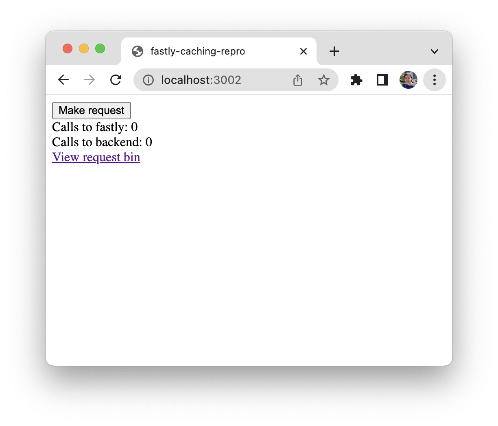

# fastly-caching-repro

Minimal reproduction of caching not happening on a Compute@Edge service.

## Usage

1. Install the [Fastly CLI](https://developer.fastly.com/learning/tools/cli).
2. Install [Node.js](https://nodejs.org/)
3. Install dependencies with `npm install`

Now either:
- Start the local server with `npm start`, and navigate to http://localhost:3002
- Deploy the server with `npm run deploy`, and navigate to your deployed service endpoint

This should show you a webpage where you can run the test, which looks something like:

## Expected behavior

When clicking the 'Make request' button multiple times, only one request should be made to webhook.site, as the request to webhook.site (a request-bin like service) should be cached as it's a GET request, to the same endpoint, with no headers/params, and a CacheOverride asking for a long ttl. This should result in the page showing the 'Calls to fastly' number be higher than the 'Calls to backend' number.

This behavior is expected based on [Fastly's documentation](https://developer.fastly.com/learning/compute/javascript/#communicating-with-backend-servers-and-the-fastly-cache):

> Requests forwarded to a backend will transit the Fastly cache, and the response may come from cache. Where a request doesn't find a matching result in cache, it will be sent to the origin, and the response will be cached based on the freshness rules determined from its HTTP response headers (unless overridden, as in the example above, by CacheOverride).

And a backend appears to be defined as we have done in our fastly.toml:

> A Request can be forwarded to any backend defined on your service. If you specify a backend hostname as part of completing the fastly compute deploy wizard, it will be named the same as the hostname or IP address, but with . replaced with _ (e.g., 151_101_129_57).

## Actual behavior

Every request results in a request to our backend service. This can add result in significant load or cost.

We can confirm multiple requests are made based on:
- the page tracking the requests to fastly and the backend (by checking the unique id header that webhook.site adds to each requests)
- the request bin admin panel

On our real service, where we control the backend, the same behavior appears to happen if we set a `Surrogate-Control` header to a long value on the response headers from the backend, so this doesn't seem to be a CacheOverride-specific problem.
